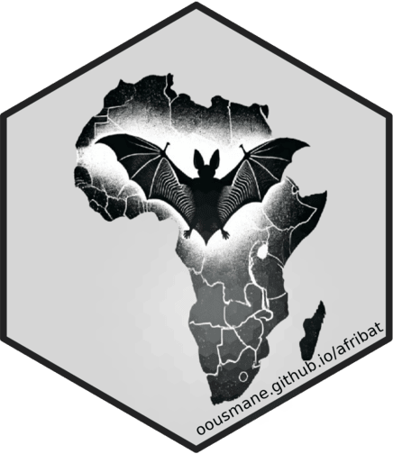

<!-- README.md is generated from README.Rmd. Please edit that file -->

```{r, include = FALSE}
knitr::opts_chunk$set(
  collapse = TRUE,
  comment = "#>",
  fig.path = "man/figures/README-",
  out.width = "100%"
)

```


# afribat: African Bat Database in R <a href="https://dplyr.tidyverse.org"></a>


<!-- badges: start -->

<!-- badges: end -->

The {afribat} R package provides access to the African Bat Database in the form of `tibble` (tabular) or `sf` (spatial) objects.
This package is designed to enhance reproducibility in ecological and evolutionary research by seamlessly integrating AfriBat data into the R programming ecosystem.
It serves as a valuable tool for researchers focusing on bat ecology, biodiversity, and conservation.

## Background

The African bat database is the first accessible dataset of occurrence records, distribution models and conservation metrics for all bat species in sub-Saharan Africa where all the records have been carefully examined and corrected for current taxonomy.
This database has been a long time in the making and will be crucial in resolving the distributions of poorly recorded bat taxa in sub-Saharan Africa.

The database contains 17,285 unique locality records of all of the 266 species of bats currently recognized from sub-Saharan Africa (Fig. 2).
The number of species recognized in this region has increased by 60% in the last 100 years, and 17% since 2000.
In recent years, the increase in species numbers was primarily due to new species being discovered (both de novo descriptions and epithet splits) in the families Vespertilionidae, Rhinolophidae, Pteropodidae and Miniopteridae.

The database is intended to be a dynamic, living dataset that will be updated regularly, at least once a year, or as new data becomes available, and errors are identified and corrected.
Future updates will welcome new or previously unavailable data, will incorporate taxonomic classification changes, and will include the distribution of newly resolved and described species.
Updates of the dataset will be made directly on Github (<https://github.com/kanead/Bat_database>)

## Installation

You can install the development version of afribat from [GitHub](https://github.com/) with:

``` r
# install.packages("pak")
pak::pak("oousmane/afribat")
```

**Note**: Two important dependencies of {afribat}, the {sf} package for spatial data science and the {readr} package for tabular data read in and write out , require some low-level software libraries to be installed on your system.
Depending on which operating system you use, this can mean that you have to install these system requirements first, before you can install {afribat}.
See the installation guides of sf and readr or details.
To use effectively the data package, consider to install the entire tidyverse ecosystem.

If you want to install {sf} and readr or tydiverse

```{r eval=FALSE}
# install sf and readr only
  install.packages(
    c(
      "sf",
      "readr"
    )
  )
# install sf and tidyverse, readr is actually included in tidyverse (a bit long )
  install.packages(
    c(
      "sf",
      "tidyverse"
    )
  )

```

## Retrieving data using administrative units

This package serves as a comprehensive data resource, bundling the entire database and making it readily available as tibble or sf objects for advanced analysis.
Designed to integrate seamlessly into workflows within the R programming environment, it provides a streamlined approach to data handling and spatial analysis.

The example below demonstrates how to load the spatial version of the database and extract information for a specific administrative level—such as `admin1` ie 'Burkina Faso', highlighting the package's flexibility and ease of use.
This is for learning purpose.
Some considerations are neglicted.

```{r warning=FALSE, message=FALSE}
library(sf)
library(afribat)


# Load data
afribats_sf <- afribat::afribats_sf

# Load Burkina Faso boundary
bf <- read_sf("https://github.com/oousmane/hexburdb/raw/main/map/admin0.gpkg")

# Spatial filtering and year filtering
bats80 <- st_filter(afribats_sf, bf, .predicate = st_within) |> 
  dplyr::filter(year == 1980)


# Extract species names
species <- bats80 |> 
  st_drop_geometry() |> 
  dplyr::pull("species") |> 
  as.character()

# Check species
if (length(species) == 0) {
  stop("No species data found for the filtered dataset")
}

# Example usage of margalef index
margalef(species)

```

## Biodiversity indices

{afribat} provides a set of functions to compute common ecological diversity indices.
Each index includes its formula, conceptual explanation, and an example.
References are provided for further reading.

### Margalef diversity index

The Margalef index measures species richness adjusted for sample size.
It emphasizes the number of species ($S$) relative to the total number of individuals ($N$).
The formula is given by :

$$
D_M = \frac{S - 1}{\log(N)}
$$ where :

-   $S$: Number of unique species\
-   $N$: Total number of individuals in the sample

The Margalef index provides a measure of species richness while accounting for the size of the sample.
Larger samples are expected to have more species.

For further reading see : Margalef, R.
(1958).
Information theory in ecology.
General Systems, 3, 36–71.

```{r}
library(afribat)
margalef(species)
```

### Shannon-Weiner Index

The Shannon-Weiner index measures the diversity of a community by considering both the richness and evenness of species.
It is derived from information theory and quantifies the uncertainty (entropy) in predicting the species of an individual randomly selected from the sample.
The formula is given by

### Formula

$$
H = -\sum_{i=1}^{S} p_i \log(p_i)
$$

Where:

-    $H$: Shannon-Weiner index (diversity)

-    $p_i$: Proportion of individuals belonging to species $i$ ($p_i = \frac{n_i}{N}$)

-    $n_i$: Number of individuals in species $i$

-   $N$: Total number of individuals in the community

-   $S$: Total number of unique species

The Shannon-Weiner index provides a measure of biodiversity.
A higher $H'$ value indicates a more diverse and evenly distributed community.

**Example Calculation**

Given the following dataset:

| Species | Count |
|---------|-------|
| Oak     | 3     |
| Pine    | 2     |
| Maple   | 1     |

-   Total individuals ($N$) = 3 + 2 + 1 = 6
-   Proportions ($p_i$):
    -   $p_{\text{Oak}} = \frac{3}{6} = 0.5$
    -   $p_{\text{Pine}} = \frac{2}{6} = 0.333$
    -   $p_{\text{Maple}} = \frac{1}{6} = 0.167$

$$
H = -(0.5 \log(0.5) + 0.333 \log(0.333) + 0.167 \log(0.167))
$$ 
$$
H = 1.011
$$

```{r}
shannon_weiner(species)
```

**Interpretation**

-   **High** $H$: Indicates a diverse community with even distribution of species.

-   **Low** $H$ : Suggests dominance by a few species or low species richness.

For further reading, see : Shannon, C. E., & Weaver, W.
(1949). 
*The Mathematical Theory of Communication*.
Urbana, IL: University of Illinois Press.

### Simpson's Dominance Index

The Inverse Simpson's Index is another diversity measure related to Simpson's Dominance Index. Instead of quantifying the probability that two randomly selected individuals belong to the same species, it focuses on the effective number of equally abundant species. The formula for Simpson's index computation is given by : 

$$
D = \frac{1}{\sum_{i=1}^{S} p_i^2}
$$

Where:
-  $D$: Simpson's Dominance Index (inverse)
-  $p_i$: Proportion of individuals belonging to species $i$ $p_i = \frac{n_i}{N}$
-  $n_i$: Number of individuals in species $i$ 
-  $N$: Total number of individuals in the community
-  $S$: Total number of unique

The Inverse Simpson's Index can be interpreted as the number of equally abundant species necessary to produce the given community diversity. A higher value indicates greater diversity, as it suggests you would need more equally abundant species to achieve the observed distribution.

**Example Calculation**

Given the following dataset:

| Species | Count |
|---------|-------|
| Oak     | 3     |
| Pine    | 2     |
| Maple   | 1     |

- Total individuals ($N$)) = $3 + 2 + 1 = 6$
- Proportions ($p_i$):
  - $p_{\text{Oak}} = \frac{3}{6} = 0.5$
  - $p_{\text{Pine}} = \frac{2}{6} = 0.333$
  - $p_{\text{Maple}} = \frac{1}{6} = 0.167$

$$
\sum p_i^2 = (0.5)^2 + (0.333)^2 + (0.167)^2 = 0.25 + 0.111 + 0.028 = 0.389
$$

$$
\text{Inverse Simpson's Index} = \frac{1}{0.389} \approx 2.57
$$

This suggests that the community diversity is roughly equivalent to having 2.57 equally abundant species.

```{r}
simpson(species)
```


For further reading, see : Simpson, E. H. (1949). Measurement of diversity. Nature, 163(4148), 688.
